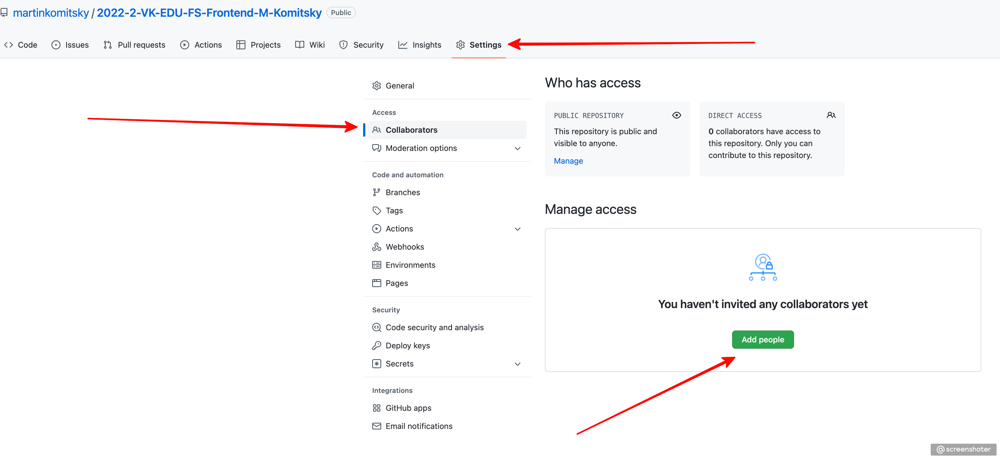
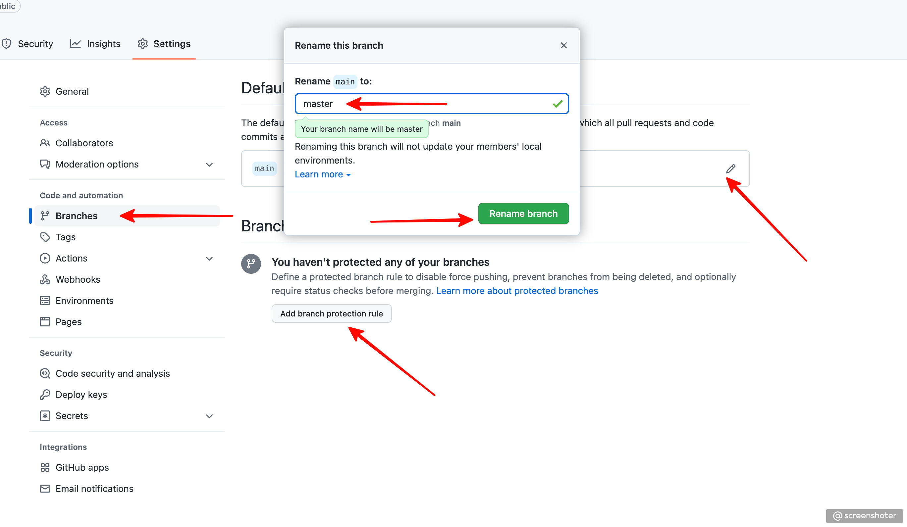

# homework

### Инструкция по рабочему процессу с ДЗ

### 1. Создаем репозиторий
* Заходим на [GitHub](https://github.com/)
* Создаем новый репозиторий


### 2. Присваиваем имя репозиторию по шаблону
* Создаем имя репозитория по следующему шаблону:

`YYYY-HALF_YEAR-VK-EDU-Frontend-N-LAST_NAME `, где:

`YYYY` - год

`HALF_YEAR` - половина года. `1`, если сейчас месяц  `янв-июн`, `2`, если `июл-дек`

`N` - первая буква имени

`LAST_NAME` - фамилия

Например, `2024-2-VK-EDU-Frontend-M-Komitsky`.

Пожалуйста, проверьте дважды правильность имени вашего репозитория, это облегчит работу по проверке и оценке ваших работ.


### 3. Добавляем преподавателей в коллабораторы
 * Заходим в настройки репозитория (/settings/collaboration)
 * Добавляем `martinkomitsky`, `haseprogram`, `kgrechin`, a также вашего назначенного ментора из [таблицы](https://docs.google.com/spreadsheets/d/1z4i3buEEUxLCxvzkZVukBerH4Y2j66O9HC5SPYY2DkE/edit?gid=0#gid=0) в collaborators

 Нам придут приглашения, перед сдачей ДЗ нужно будет дождаться, пока мы их примем.



### 4. Создаем правило для ветки
* Заходим в настройки веток (branches)
* Переименовываем ветку main в master
* Создаем новое правило



### 5. Настраиваем правило
* Защищаем ветку `master` от пуша
* Требуем мерж по пулл-реквесту с обязательным апрувом от одного ревьюера


### 6. Создаем шаблон для PR
* Создаем файл с именем `pull_request_template.md` в корне проекта
* Содержимое должно быть следующим:
```md
# Домашнее задание №

Прошу @martinkomitsky, @haseprogram, @kgrechin или @ваш_назначенный_ментор проверить его.

Что было сделано:
*
*
*

```

Это шаблон для ваших `PR`, в котором есть упоминания всех преподавателей (для получения уведомлений). Сам файл при сдаче ДЗ редактировать не нужно. Вместо этого, при создании `PR` нужно в `GitHub` коротко описать проделанную работу.

___

### 7. Сдаем ДЗ на проверку
* После выполнения домашнего задания, создаем пулл-реквест в ветку `master`
* Добавляем `martinkomitsky`, `haseprogram`, `kgrechin`, a также вашего назначенного ментора из [таблицы](https://docs.google.com/spreadsheets/d/1z4i3buEEUxLCxvzkZVukBerH4Y2j66O9HC5SPYY2DkE/edit?gid=0#gid=0) в поле `reviewers`
* Добавляем того, кто выдал домашнее задание (лектора конкретной лекции), a также вашего назначенного ментора из [таблицы](https://docs.google.com/spreadsheets/d/1z4i3buEEUxLCxvzkZVukBerH4Y2j66O9HC5SPYY2DkE/edit?gid=0#gid=0) в поле `assignee`
* В теме **обязательно** пишем номер ДЗ, в описании опционально пишем то, что сделано
* Проверяем, нет ли конфликтов. Если есть, их надо исправить
* Просмотреть свою работу. Если в PR прилетели файлы сборки (`build`, `dist` и пр.), папка `node_modules` или прочие вещи, которые не должны быть в репозитории, их надо удалить, а также добавить в `.gitignore`, чтобы они больше не попадали в репозиторий


### 8. Ожидаем проверки и вносим правки
 * Жмем на большую зеленую кнопку и ждем комментариев
 * Если всё выполнено корректно - выполняется мерж преподавателем
 * Если есть недочеты - будут оставлены замечания, которые надо будет быстро исправить и запушить в текущий PR. Мы их увидим и пересоздавать PR не нужно

### 9. Правила сдачи ДЗ
* Для всех ДЗ один репозиторий
* В одном PR сдается только **одно** ДЗ
* Каждые ДЗ, которое непосредственно относится к разработке проекта, необходимо делать в одной и той же папке. Ни в коем случае не делать отдельные папки для каждого ДЗ. Для версионирования у нас есть `git`
* Каждое ДЗ делается в отдельной ветке, чтобы избежать возможных конфликтов при мерже
* Каждая ветка, из которой делается PR, должна быть синхронизирована с `master`. См. сниппет ниже
* Если в уже существующем PR образовался конфликт, его необходимо разрешить. См. сниппет ниже

<details>
  <summary>Как синхронизировать свою рабочую ветку с <code>master</code></summary>
  <pre><code># Находясь в своей рабочей ветке
git pull origin master
# Если есть конфликты, их необходимо разрешить, потом выполнить `git commit` без каких-либо параметров
git push origin HEAD</code></pre>
</details>

<details>
  <summary>Как разрешить конфликт</summary>
  <ul>
    <li>https://docs.github.com/en/pull-requests/collaborating-with-pull-requests/addressing-merge-conflicts/resolving-a-merge-conflict-using-the-command-line</li>
    <li>https://www.simplilearn.com/tutorials/git-tutorial/merge-conflicts-in-git</li>
    <li>https://blog.knoldus.com/how-to-resolve-merge-conflicts-in-git-pull-request-pr/</li>
  </ul>
</details>


### 10. Критерии оценки ДЗ
* Для того, чтобы успешно сдать домашнее задание без применения штрафов (снятие 30% баллов) - нужно вовремя заблаговременно создать PR
* Срок сдачи каждого задания - 2 недели с момента его выдачи на лекции, но не позднее 23:59:59 дня перед лекцией
* Если вы уложились с решением ДЗ в 2 недели, то получаете к максимальным 10 баллам еще дополнительных 2 за "скорость"
* Если вы не уложились в 2 недели, но сдали ДЗ на семинаре, то вы получаете максимально 10 баллов
* Если вы не сдали ДЗ на семинаре текущего модуля, то применяется штраф 30% от максимальных 10 баллов, что делает максимальную оценку после штрафа равной 7
* Максимальной оценкой оценивается решение, которое было выполнено правильно с первого раза
* Если были допущены сильные недочеты, то баллы снижаются в зависимости от тяжести положения
