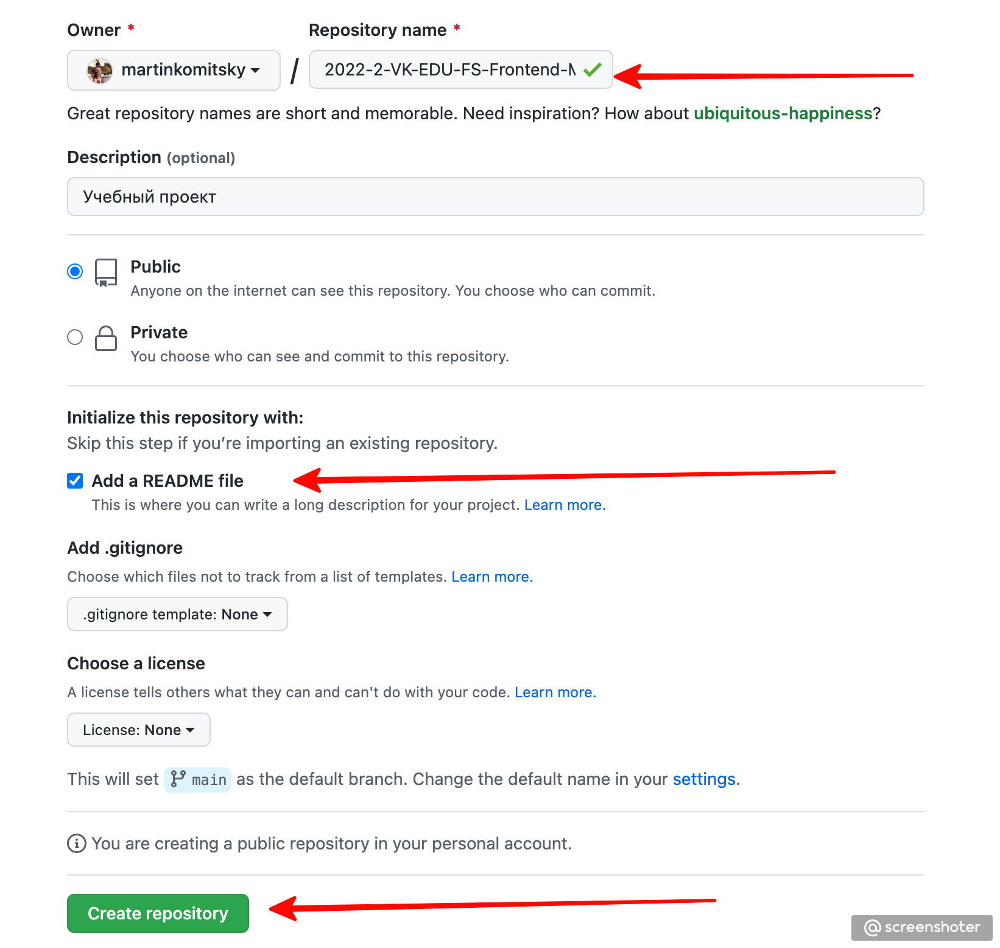
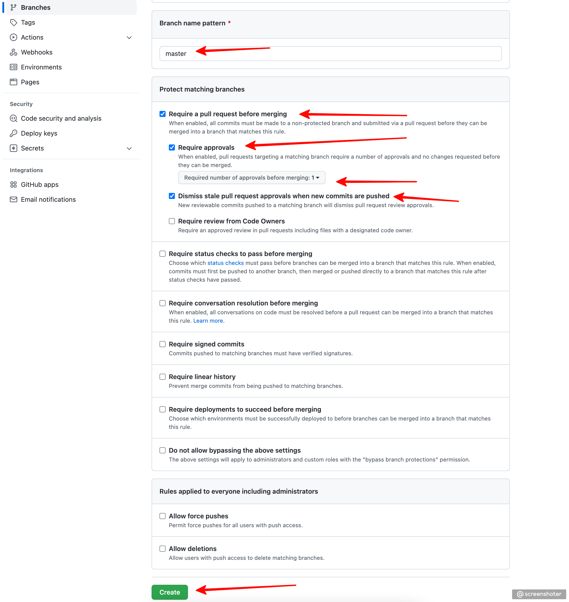
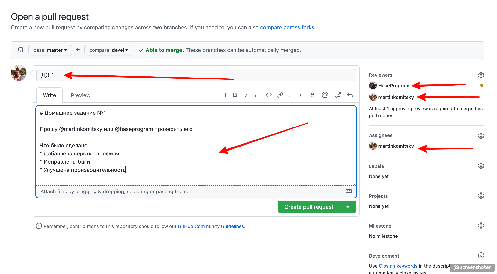

# homework

### Инструкция по рабочему процессу с ДЗ

### 1. Создаем репозиторий
* Заходим на [GitHub](https://github.com/)
* Создаем новый репозиторий


### 2. Присваиваем имя репозиторию по шаблону
* Создаем имя репозитория по следующему шаблону:

`YYYY-HALF_YEAR-VK-EDU-FS-Frontend-N-LAST_NAME `, где:

`YYYY` - год

`HALF_YEAR` - половина года. `1`, если сейчас месяц `янв-июн`, `2`, если `июл-дек`

`N` - первая буква имени

`LAST_NAME` - фамилия

Например, `2022-2-VK-EDU-FS-Frontend-M-Komitsky`.

Пожалуйста, проверьте дважды правильность имени вашего репозитория, это облегчит работу по проверке и оценке ваших работ.



### 3. Добавляем преподавателей в коллабораторы
 * Заходим в настройки репозитория (/settings/collaboration)
 * Добавляем `martinkomitsky`, `haseprogram` и `vaganov-spb` в collaborators

 Нам придут приглашения, перед сдачей ДЗ нужно будет дождаться, пока мы их примем.


### 4. Создаем правило для ветки
* Заходим в настройки веток (branches)
* Переименовываем ветку main в master
* Создаем новое правило


### 5. Настраиваем правило
* Защищаем ветку `master` от пуша
* Требуем мерж по пулл-реквесту с обязательным апрувом от одного ревьюера



### 6. Создаем шаблон для PR
* Создаем файл с именем `pull_request_template.md` в корне проекта
* Содержимое должно быть следующим:
```md
# Домашнее задание №

Прошу @martinkomitsky или @haseprogram проверить его.

Что было сделано:
*
*
*

```

Это шаблон для ваших `PR`, в котором есть упоминания всех преподавателей (для получения уведомлений). Сам файл при сдаче ДЗ редактировать не нужно. Вместо этого, при создании `PR` нужно в `GitHub` коротко описать проделанную работу.

### 7. Сдаем ДЗ на проверку
* После выполнения домашнего задания, создаем пулл-реквест в ветку `master`
* Добавляем `martinkomitsky`, `haseprogram` и `vaganov-spb` в поле `reviewers`
* Добавляем того, кто выдал домашнее задание (лектора конкретной лекции) в поле `assignee`
* В теме **обязательно** пишем номер ДЗ, в описании опционально пишем то, что сделано



### 8. Ожидаем проверки и вносим правки
 * Жмем на большую зеленую кнопку и ждем комментариев
 * Если все выполнено корректно - выполняется мерж
 * Если есть недочеты - будут оставлены замечания, которые надо будет быстро исправить и запушить в текущий PR. Мы их увидим и пересоздавать PR не нужно

___

### 9. Правила сдачи ДЗ
* Для всех ДЗ один репозиторий
* В одном PR сдается только **одно** ДЗ
* Каждое ДЗ делается в отдельной ветке, чтобы избежать возможных конфликтов при мерже
* Каждая ветка, из которой делается PR, должна быть синхронизирована с `master`

### 10. Критерии оценки ДЗ
* Для того, чтобы успешно сдать домашнее задание без применения штрафов (снятие 30% баллов) - нужно вовремя заблаговременно создать PR
* Срок сдачи каждого задания - 2 недели с момента его выдачи на лекции, но не позднее 23:59:59 дня перед лекцией
* Если вы уложились с решением ДЗ в 2 недели, то получаете к максимальным 10 баллам еще дополнительных 2 за "скорость"
* Если вы не уложились в 2 недели, но сдали ДЗ на семинаре, то вы получаете максимально 10 баллов
* Если вы не сдали ДЗ на семинаре текущего модуля, то применяется штраф 30% от максимальных 10 баллов, что делает максимальную оценку после штрафа равной 7
* Максимальной оценкой оценивается решение, которое было выполнено правильно с первого раза
* Если были допущены сильные недочеты, то баллы снижаются в зависимости от тяжести положения
